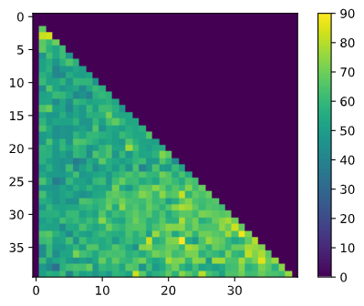

# TP3 : k-NN et DBSCAN

## Hormis k, quels autres parametres ou modifications pourrait-on apporter afin de modifier le comportement de l’algorithme ?

- On peut assigner des poids aux distances de chaque données du dataset.
- On peut assigner un poids aux points en fonction de leurs distances du point que l'on cherche (les points les plus près sont plus importants).
- On peut stocker les données d'entraînement sous forme d'arbre binaire, regroupant ainsi les points identiques et rendant l'algorithme de prédiction plus rapide (kd-tree).

## Quelle modification apporter afin d’utiliser l’algorithme en régression plutôt qu’en classification ?

On associe un Chiffre par classe. Par exemple 0, 1, et 2 à chaque classe.

## Implémenter  dans  le  langage  de  votre  choix  une version  des  kplus proches voisins

Voir le code sur [github](https://github.com/maxencerb/KNN-IRIS-ESILV).

## Résultats

### Confusion matrix


### Erreur en fonction de K sur 50 runs par valeurs de K

Pour le choix de k on avait donc 3.

.png)

Cependant, avec les nouveaux sets de données, et la méthode de kd-tree, les paramètres les plus optimisés sont k = 10 et leaf_size entre 25 et 35 :



*Les 0 (violet) correspondent aux valeurs impossibles ou non testé (k > leaf_size ou k / leaf_size = 0)*

## Discussion sur les résultats

Avec la méthode "brute", l'algorithme nécessite environ 5 voisins pour avoir l'erreur minimum. La matrice de confusion donne environ 90% de réussite.

Avec la méthode kd-tree (résultats ci-dessus), on a besoin de moins de voisins et a environ 97% de réussite. Cela peut peut être s'expliquer par le fait qu'on ne compare avec tous les voisins mais qu'avec les voisins les "plus proche". Certains voisins (qui peuvent être les plus proche) ne sont pas utilisés pour la comparaison.

## Amélioration

### pondération on fonction de la distance

Augmentation dans la précision d'environ 4%.

```python
distance = self.__get_distance(point, x_train)
order = np.argsort(distance)
y_train = y_train[order][:self.k_neighbours]
distance = distance[order][:self.k_neighbours]

# mean value of the k nearest neighbours (same weight)
return np.argmax(np.bincount(y_train))

# Try to give different weights according to distance
class_choice = np.zeros(5) # nombre de classes
for i in range(len(y_train)):
    class_choice[y_train[i]] += 1/distance[i]
return np.argmax(class_choice)
```
