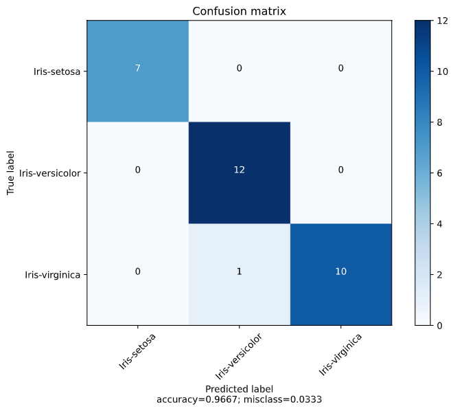

# K-NN Algorithm (no library)

&copy; Maxence Raballand 2021

## About

This is an algorithm I wrote for a school exercise. This k-nn uses regression so you have to convert your classes (labels) to integer  for examples (class1 = 0, class2 = 1, class3 = 2, ...)

This algorithm was written with practically no help from forums or external ressources at all (for the knn part) so this may not be very efficient and precise.

## Usage

```python
from k_nearest_neighbours import KNearestNeighbours, Algo

x_train, y_train, x_test, y_test = ...

knn = KNearestNeighbours.fit(x_train, y_train, k_neighbours = 5, algo = Algo.KD_TREE, leaf_size = 20)

y_hat = knn.predict(x_test)

from sklearn.metrics import confusion_matrix

cm = confusion_matrix(y_test, np.array(list(map(int, x_test_predict))))

print(cm)
```

You can plot the confusion matrix with an algorithm from my init file I took on a forum (link in the function doc) and feed the confusion matrix with your classes used

```python
from init import plot_confusion_matrix

plot_confusion_matrix(cm, CLASSES)
```


